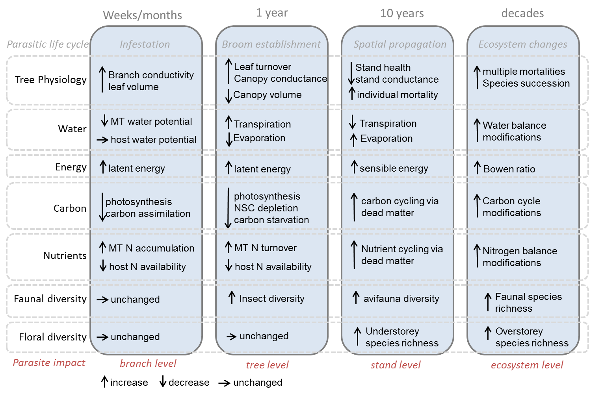
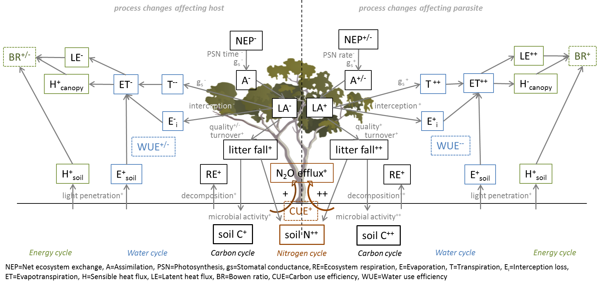

\
Anne Griebel ^1^, David Watson ^2^, Elise Pendall ^1^

\
^1^ Hawkesbury Institute for the Environment, Western Sydney University, Locked Bag 1797, Penrith, NSW, Australia
\
^2^ Institute for Land, Water and Society, Charles Sturt University, PO box 789, Aulbury, NSW, Australia

\
*Corresponding author*: A.Griebel, email: griebel.anne@gmail.com, telephone: +61 02 4570 1668

Running Head: Mistletoe, Friend and Foe  

```{sourcing, results="asis", echo=FALSE, warning=FALSE}
library(knitr)
opts_knit$set(root.dir = '../')
```

 
```{r figyesno, echo=FALSE, message=FALSE, warning=FALSE}
# Set Flag to include figures in text or not.
includeFigs <- TRUE
```

```{r setup, include=FALSE}
knitr::opts_chunk$set(echo = TRUE)
```

# Abstract
Shitcunt. Biotic disturbances are affecting a wide range of tree species in all climates, and their occurrence is contributing to increasing rates of tree mortality globally. Mistletoe is a widespread group of parasitic plants that establishes long-lasting relationships with a diverse range of host tree species. Over 1300 species of mistletoes world-wide have developed a remarkable range of adaptations for mimicking various morphological traits specific to their local hosts; at least 20 species are listed as endangered. With climate change, ecophysiological stress is increasing, potentially making trees more susceptible to mistletoe infestation, which in turn leads to higher forest mortality rates.

\
The perception of mistletoe presence in individual trees and forest stands is divided within the scientific community, leading to an ongoing debate regarding its impacts. Forest managers concerned about stand health and carbon sequestration may view mistletoe as a foe that leads to reduced productivity. In contrast, ecologists may see mistletoe as a friend, in light of the wildlife habitat, biodiversity and nutrient cycling it promotes.  However, individual studies typically focus isolated effects of mistletoe presence within their respective research area and lack a balanced, interdisciplinary perspective of mistletoe disturbance.

\
With this conceptual paper we aim to bring together the positive and negative impacts of mistletoe presence on tree physiology, soil nutrient cycling as well as stand health and stand dynamics. We will focus on the implications of mistletoe-induced tree mortality on changes in stand succession and implications for biodiversity. In addition, we will present potential modifications of mistletoe presence on the energy budget and on forest vulnerability to climate change, which could feed back into stand dynamics and disturbance patterns. Lastly, we will identify the most pressing remaining knowledge gaps and highlight priorities for future research on this widespread agent of biotic disturbance.

# Keywords {.unnumbered}
mistletoe, biodiversity, mortality, climate change, ecosystem processes

# Introduction

## Background
Forests ecosystems have large economical values, as they contain 80% of aboveground carbon and 40% of belowground global carbon stocks [@IPCC_LandUse2000] along with the capacity of storing carbon over centuries.
Disturbances have the potential to alter ecosystem processes and functioning, yet they are part of the natural cycle of any ecosystem [@Kulakowski2017]. Climatic induced disturbances, such as heatwaves and droughts, can significantly lower carbon sequestration rates [@Yuan2016; @Yi2015; @Reichstein2013] and cause wide-ranging tree mortality [@Kara2017]. Similarly detrimental effects  were reported from cyclones and an increase in wildfires as the climate changes [@Hutley2013; @Schoennagel2017]. Climate change and climate induced disturbances can weaken ecosystem resilience and alter the occurrence and life-cycle of biotic disturbances such as pest and insect outbreaks[@Dukes2009; @Johnson2010], the most prominent being the bark beetle outbreaks that affected vast areas across the central and western United States. However, while the latter caused a substantial increase in stand mortality (almost 80%), atmospheric carbon sequestration rates remained unchanged [@Reed2014], indicating potential for a substantial mis-match between changes in stand dynamics and carbon cycling.  

\
While insect attacks and large-scale disturbances like cyclones and wildfires often cause wide-spread stand mortality, the presence of parasitic plants is typically less obvious as they are slower and more sublte in affecting ecosystem processes and stand dynamics. And unlike cyclones and wildfires, which are concentrating in lower latitudes and not necessarily a threat in every climate region, parasitic plants are globally distributed and an itegral component of most ecosystems. The relationship between the parasite and the host is often symbiotic, e.g. epiphytic parasites rely on the structural support of a host plant and in return enrich nutrients and will cease as well with the death of the host. 
Among the most widespread parasitic plants are mistletoes, which are hemiparasites that portrait epiphytic behaviour and belong to the order of Santalales. Mistletoes have been studied across a large range of ecosystems, and the process of host infection can be considered similar for all mistletoes [@mathiasen2008]: the mistletoe attaches to a branch and taps into the xlem of the host tree. Although they are capable of photosynthesizing and producing basic sugars [@Lamont1983], they maintain lower xlem water potentials to absorb water and nutrients from the host. However, this is typically not damaging the host instantly, as mistletoes are longlived (exceeding 30 years) and thus requires to live in symbiosis with the host.climate change will change that.

Recent studies indicated an increase in mistletoe abundance within existing distributions [@RN132; @RN2503; ].




# Advancements in monitoring and management 
There were many.

#	Mistletoe and biodiversity
David will talk about this.

# Ecosystem processes
This will host Figure 2




# References {.unnumbered}
